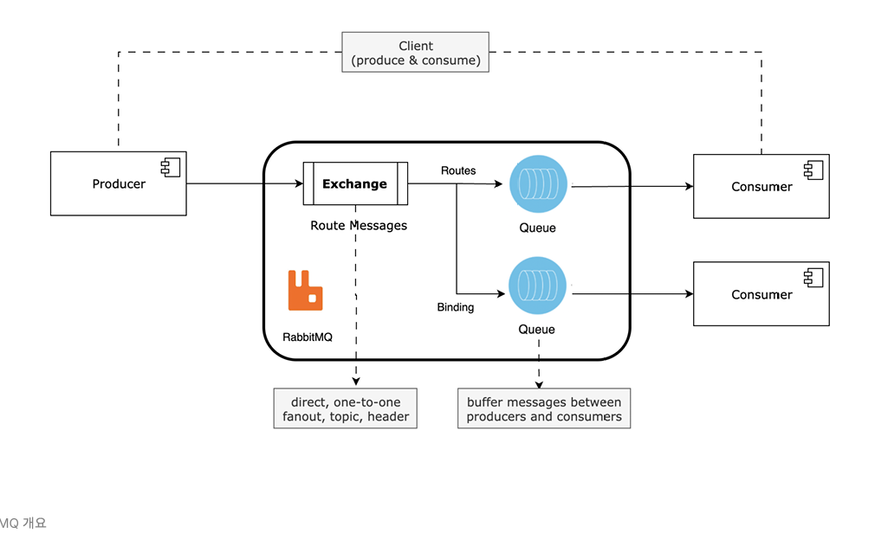
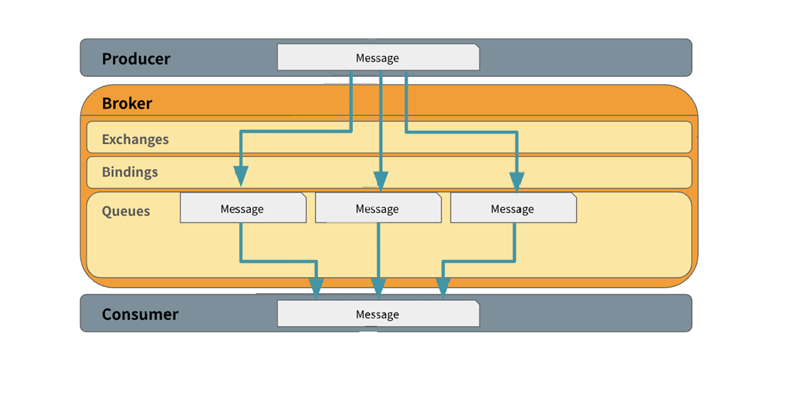

# RabbitMQ 개요

## 개요 

RabbitMQ는 얼랭으로 만들어진 메시지 전송 브로커 오픈소스이다.
시스템간 비동기 메시징을 가능하게 하여 서비스 간의 통신을 안정적이고 효율적 처리가 가능하게 한다.
플랫폼 중립적이고, 가볍고 다양한 언어들의 클라이언트 라이브러리를 제공하며 유연한 성능과 안정성을 제공.

클러스터를 설정할때 큐를 HA로 설정하여 여러 노드에 저장하므로서, 메시지 손실을 방지한다.
새로운 기능을 쉽게 추가할 수 있고 데이터 동기화와 다중 마스터 복제를 구성할 수 있다.

MSA 환경에서 일반적으로 쓰이며 비동기 처리와 지연이 필요한 작업을 효과적으로 관리해준다.

## 메시지큐를 사용하는 이유

- 비동기 메시지를 사용하여 다른 응용프로그램 사이에 데이터를 송수신
- 클라이언트에 대한 동기 처리는 병목의 요인이므로 비동기 처리 해도 될 영역에 대해서는 큐를 통해 분리하여 처리한다.
- 결국 분산환경에서 응용프로그램들을 분리하고 독립적으로 확장하기 위해서 사용, 기능 별로 모듈 구성이 용이(Scalability)
- 요청에 대한 응답을 기다릴 필요가 없기 때문에 각 영역의 역할만 신경쓰면 된다. 어플리케이션 레벨에서 분리 할 수있다.

- 데이터를 메모리 대신에 디스크에 저장하여 데이터 유실을 방지 (Realiability)
- 즉시 처리하지 않아도 나중에 재처리가능
- 메시지 영구저장, 메시지 확인, 장애 복구 메커니즘을 통하여 메시지의 신뢰성을 확인합니다.

- 확장성 : 여러 노드에 걸쳐 쉽게 확장할 수 있어 높은 가용성을 제공하여, 필요에 따라 메시지를 클러스터링하거나 페더레이션 방식으로 확장이 가능하다.
- 유연성 : 다양한 Exchange 유형과 라우팅 규칙을 지원하여 메시지를 효과적 라우팅이 가능하고 관리 할 수 있다.

## AMQP
Advanced Message Queing Protocol의 약자로 흔히 알고 있는 MQ의 오픈소스에 기반한 표준 프로토콜을 의미한다.

위 사진에서 말하는 one to one Fanout의 경우 Fanout Exchange는 여러 Queue에 메시지를 BroadCast하지만, 각 큐에 연결된 소비자는 한명이기 때문에 메시지는 각각의 큐에서 하나의 소비자에게만 전달되므로 1:1 방식의 메시지 소비를 의미한다.
여러 소비자에게 동시에 메시지를 전달하되 가되 메시지가 단일 소비자에게만 전달하다록 보장하고 싶은 경우를 의미한다고 보면된다.

## AMQP 특징
- 모든 broker들을 똑같은 방식으로 동작할 것
- 모든 Client들은 똑같은 방식으로 동작할 것
- 네트워크 상으로 전송되는 명령어들의 표준화
- 프로그래밍 언어 중립적

## Routing Model Components
AMQP 의 라우팅 모델은 아래와 같은 3개의 주요한 componenet 들로 구성된다.
- Exchange
- Queue
- Binding

각 컴포넌트들을 아래와 같은 상세 기능들을 수행한다.

#### - Exchange : Publisher로부터 수신한 메시지를 적절한 큐 또는 다른 Exchange로 분배하는 라우터의 기능을 한다.
#### - Queue : 일반적으로 알고 있는 큐이다. 메모리나 디스크에 메시지를 저장하고, 그것을 consumer에게 전달하는 역할을 한다.
#### - Binding : exchange와 큐와의 관계를 정의한 일종의 라우팅 테이블이다. 같은 큐가 여러 개의 exchange에 bind 될 수도 있고, 하나의 exchange에 여러 개의 큐가 binding 될 수도 있다.

#### - Routing Key: 라우팅 키는 발행된 메시지와 큐가 라우팅 테이블을 통해 매칭되는 키를 뜻합니다. Publisher, 혹은 producer 로 칭하는 송신부에서 송신한 메시지 헤더에 포함되는 것으로 일종의 가상주소라고 보면된다.

