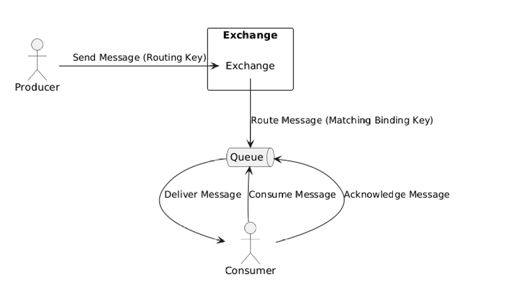
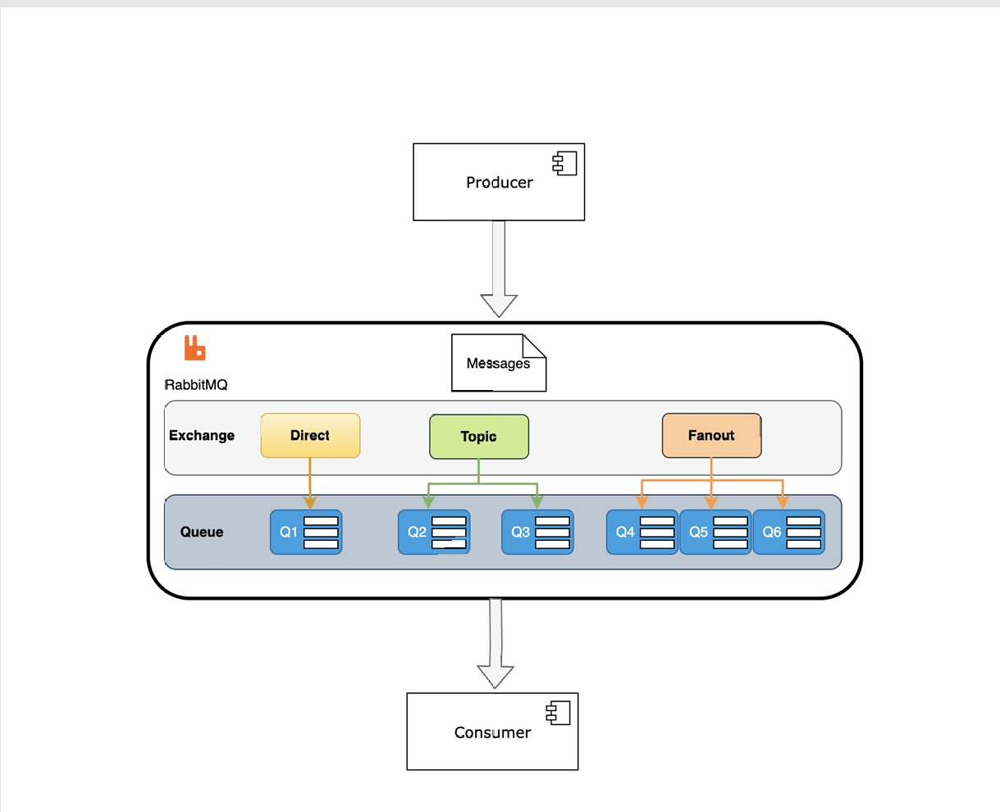
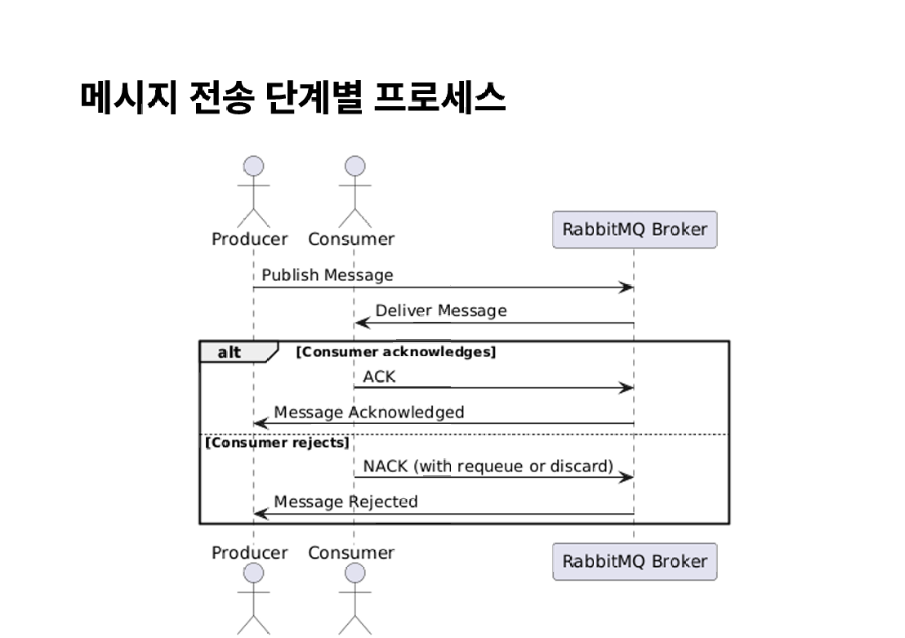

# 주요 용어와 Exchange의 이해

## RabbitMQ 주요 용어 정리

### 1. Producer (생산자):
- 메시지를 생성하고 RabbitMQ에 전송하는 애플리케이션
- Producer는 특정 Exchange에 메시지를 전송하고 Exchange는 메시지를 라우팅하여 큐에 배치

### 2. Exchange : 
- Producer로 부터 받은 메시지를 큐에 전달
- Exchange 유형 : 
    - Direct: 특정 라우팅 키와 정확히 일치하는 큐에 메시지를 전송
    - Fanout: 모든 큐에 메시지를 브로드캐스트
    - Topic: 라우팅 키 패턴을 기반으로 메시지를 특정 큐에 전달
    - Headers: 메시지 헤더 속성에 따라 메시지를 라우팅
### 3. Routing Key : 
- 메시지를 전송할 때 Producer가 Exchange에 전달하는 키
- Exchange는 이 Routing Key를 참고하여 어떤 큐에 메시지를 전달할지 결정한다.

### 4. Queue : 
- 메시지를 일시적으로 저장하는 버퍼 역할, RabbitMQ의 큐는 FIFO 방식으로 동작하며, 메시지가 소비자에게 전달될 때 까지 보관.
- 각 큐는 여러 Consumer가 구독(수신)할 수 있으며, 메시지는 큐에 들어온 순서대로 전달
- 비동기적으로 동작하며, 여러 컨슈머가 동시에 메시지를 소비할 수 있다. 단 하나의 메시지가 여러 소비자에게 중복으로 전달될 수는 없다. 동일한 메시지를 수신하려면 Fanout Exchange 방식으로 가야만함.

### 5. Binding : 
- exchange와 큐간의 관계를 정의
- 바인딩의 메시지를 라우팅할 때 어떤 조건으로 큐에 보낼지 정의하고 이를 위해 binding key가 사용됨
- Binding Key와 Routing Key 가 일치하며 해당 큐로 메시지가 전달(패턴 매칭 가능)

### 6. Consumer (소비자) : 
- 큐에서 메시지를 가져와 처리하는 애플리케이션
- RabbitMQ는 여러 소비자에게 메시지를 로드밸런싱 할 수 있다.
- Consumer는 큐에서 메시지를 받아 처리하면 메시지에 대한 확인(Ack)를 브로커에 전송한다.
- 확인을 보내지 않으면, 브로커 메시지를 재전송하거나 설정한 다른 Consumer에게 전달할 수 있다.

### 7. Message Acknowledgment (메시지 확인):
- 메시지가 성공적으로 처리되었음을 RabbitMQ에 알리는 과정
- 만약 소비자가 메시지를 성공적으로 처리하지 못했다면, 메시지를 다시 큐에 넣어 다른 소비자가 처리하도록 할 수 있다.

1. Producer가 메시지와 Routing Key를 Exchange에 전송
2. Exchange가 Routing Key를 사용하여 Binding Key가 일치하는 큐에 메시지를 라우팅
3. Consumer가 큐에서 메시지를 가져와서 처리하고 성공적 처리가 되었음을 acknowlegement로 RabbitMQ에 알림.

## 추가 용어

1. Prefetch Count(프리페치 카운트):
- 소비자가 받을 수 있는 최대의 메시지 수를 설정한다.
- 한 번에 많은 양의 메시지를 처리하지 않도록 하여 소비자의 성능을 최적화한다.

2. Virtual Host
- RabbitMQ 서버 내의 논리적인 구획으로, 메시지 큐, 익스체인지, 사용자 권한등을 구분
- 하나의 RabbitMQ 서버 내의 여러 개의 가상 Host 설정하여 서로 다른 어플리케이션 메시지 격리가 가능하다

3. DLQ : 메시지가 처리되지 못하거나 유효기간이 자난 경우 별도의 큐로 이동하는 구조도 설정할 수 있다.

## Exchange 유형에 따른 처리의 흐름

### Direct Exchange
#### Direct Exchange는 메시지가 라우팅 키에  따라 특정 큐로 하나씩 전달 되는 방식이다. 메시지를 발행할 때 사용하는 라우팅 키와 동일한 키로 익스체인지에 바인딩된 모든 큐에 메시지를 전달한다. 해당 라우팅 키와 일치하는 큐에만 메시지가 전달되는 방식으로 Direct Exchange라고 한다.
#### 활용 : 주문 상태별로 라우팅 키를 정의하고, 각 상태에 해당하는 큐가 메시지를 받는다. 매핑이 정확하게 되는 한 개의 키만 있으니까 1대1로 가능할 거 같은데, 하나의 라우팅 키에 대하여 여러 큐가 바인딩 될 수 있기 때문에 1:N 매칭이 가능하다.

- 메시지가 명확하게 특정 큐로 전달되어야 할 때
- 큐마다 고유한 라우팅 규칙을 적용하여 메시지를 분류해야 할때
- 예시 업무 : 주문 상태 처리, 결제 처리, 사용자 알림 시스템 등.

### TOPIC Exchange

#### Topic Exchange는 라우팅 키를 패턴 기반으로 정의하여 메시지를 여러 큐에 유연하게 전달 가능한 방식이다. 라우팅 키에 와일드카드 매칭을 사용하여 더 복잡한 라우팅이 가능하다.

- 와일드카드 * 의 경우에 하나의 단어를 대체하는 의미로 log.info, log.warn, log.error 와 같은 패턴의 메시지를 수신 할 때 log.* 로 info와 warn, error를 다 수신하게 만들 수 있다.
- .의 경우에 0개 이상의 단어를 대체하므로 app.order.success, app.payment.success 와 같은 라우팅 키를 #.success로 수신할 수 있다.

- 사용 예시 : 동적이고 유연한 라우팅이 필요할 때(로그 수집 시스템, 이벤트 기반 모니터링 등)

### Fanout Exchange

#### Fanout Exchange는 브로드캐스트 방식으로 메시지를 모든 바인딩된 큐에 전달한다. 한번의 메시지 발행으로 모든 큐가 동일한 메시지를 받는다.
- 사용 예시 : 이벤트가 발생하면 모든 서비스가 동일한 메시지를 받는 서비스에 유용하다. (시스템 점검공지)
-
### Headers Exchange : 메시지의 속성(헤더)에 기반한 복잡한 라우팅이 필요할 때.
- 사용 예시 : 다국어 서비스, 고객의 등급별 혜택 알림
- 메시지 헤더에 language : "ko" 등의 값을 설정하여 헤더 기반 라우팅을 수행.

## 메시지 전송 단계별 프로세스

- #### 1. 메시지 송신 (Producer -> Broker)
- 이때 메시지는 큐에 저장되며, 익스체인지와 바인딩 설정에 따라 적절한 큐로 라우팅

- #### 2. 메시지 전달 (Broker -> Consumer)

- Broker는 큐에 있는 메시지를 Consumer에게 전달
- Consumer는 큐에서 메시지를 가져가거나(폴링), 메시지를 푸시(Push) 받는 방식으로 수신한다.

- #### 3. 메시지 확인(ACK) 혹은 거절(NACK)

- Ack: Consumer 가 메시지를 성공적으로 처리한 후에 Broker에 ACK를 전송. 이 경우 Broker는 해당 메시지를 큐에서 제거하고 Producer에게 Message Acknowledged 응답 전송
- Nack: Consumer가 메시지 처리에 실패하거나 메시지를 거절할 경우 NACK(Negative Acknowledgment)를 전송한다. Nack에서는 메시지를 다시 큐로 보내야 할지 또는 폐기해야할지(discard) 설정 가능하다.
- 재전송 요청 (Requeue) : 메시지를 다시 큐로 보내고 쟃처리 할 수 있도록 설정한다.
- 폐기 (Discard) : 메시지를 큐에서 제거하고 , 폐기 처리한다.
- Consumer가 메시지를 NACK 하면 Broker는 Producer에게 Message Rejected 응답을 전송한다.

- #### 4. Producer에 응답 (Message Acknowledged/ Message Rejected)
- Producer가 Publisher Confirms를 활성화 한 경우, Broker는 ACK 혹은 NACK 결과를 Producer에게 전송.
- ACK를 받은 경우엔 메시지가 성공적으로 소비된 것으로 간주한다. NACK를 받은 경우 Prducer 는 메시지 실패를 기록하거나 재전송.

## Consumer 간의 작업 분배 - WorkQueue

### Work Queues : Competing Consumers Pattern

- 메시지를 여러 Consumer(소비자) 간에 분배하여 작업을 분배하여 작업을 분산 처리하는 구조. 작업 부하를 효율적으로 분산하고, 병렬 처리를 가능하게 만들어 처리 속도를 향상시킴.

- Round-Robin 방식과 Fair Dispatch 방식을 사용하여 메시지를 Consumer 간 분배한다.
- Fair Dispatch 방식은 메시지 수동 확인 모드로 개발하고 메시지 처리 비중 설정등을 통해 조정이 가능.

#### 주요 특징
1. 경쟁적인 메시지의 소비
- 여러 Consumer가 동일한 메시지 큐에서 메시지를 가져가 처리
- 특정 메시지는 한번에 하나의 Consumer에 의해 처리되므로 메시지 중복 처리 방지
2. 작업분산
- 메시지가 여러 Consumer 간에 분배되어 병렬 처리되므로 작업 부하를 효율적으로 분산
3. 확장성
- Consumer를 추가하거나 제거함으로써 작업 처리 능력을 동적으로 확장하거나 축소.
4. 내결함성
- Consumer 중 하나가 실패하더라도 다른 Consumer 작업을 이어받아 처리할 수 있어서 시스템이 중단없이 작동.