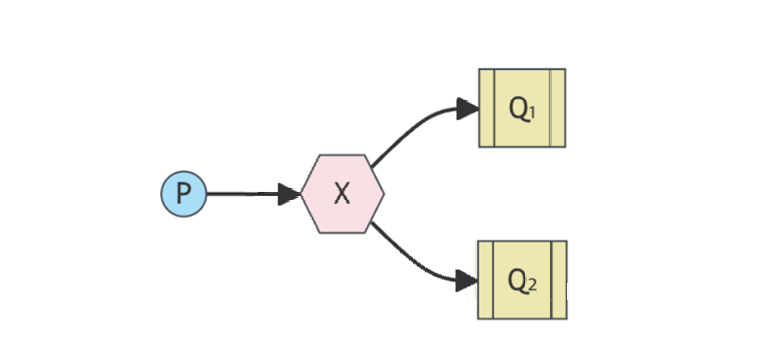
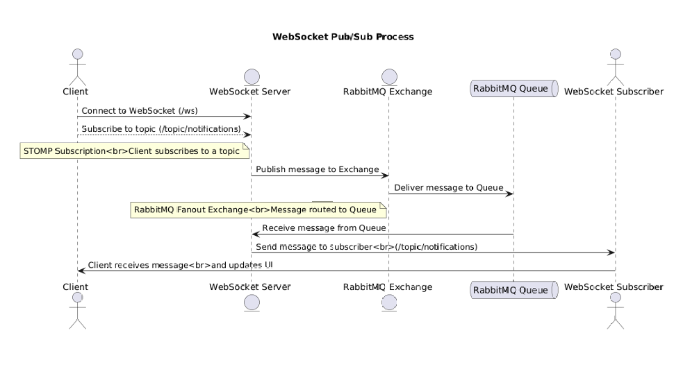

# Publish/Subscribe 모델

Pub/Sub은 메시지 발행과 구독의 개념을 기반으로 하는 메시징 패턴으로 메시지를 중간브로커 (Exchange)를 통하여
구독자(Subscriber) 에게 메시지를 전달한다.

RabbitMQ에서는 Fanout Excahnge를 통하여 연결된 모든 Queue에게 메시지를 전달하므로 Binding(excahange와 큐와의 관계를 정의한 일종의 라우팅 테이블)을 통하여 익스체인지를 연결하여 동시에 메시지를 받을 수 있다.

### Pub/Sub 모델의 주요특징
유연성과 확장성이 좋아 여러 subscriber를 쉽게 추가하여도 서로 독립적으로 동작이 가능하다

1. 다대다 메시징:
- 하나의 메시지가 여러 구독자에게 전달
- 메시지 복사가 이루어지므로 구독자는 동일한 메시지를 수신하고 동일한 메시지가 여러 큐에 처리되므로 중복 처리 로직이 필요할 수 있다.

2. 구독자 독립성:
- Publisher는 메시지가 어떤 Subscriber에게 전달되는질 알 필요가 없다.
- 메시지의 전달은 브로커가 처리한다

3. 비동기 미세징:
- Publisher와 Subscriber는 서로 독립적으로 동작하며, 동시에 실행될 필요가 없음

4. 확장성 : 
- 여러 Subscriber를 추가하거나 제거해도 시스템이 영향을 받지 않음

5. 구독 제어 :
- 구독자는 특정 조건(예 : 라우팅 키, 토픽)을 기반으로 메시지를 필터링하여 수신할 수 도 있다.
- Fanout Exchange는 모든 구독자에게 메시지를 브로드캐스트하는 반면 (Routing Key는 필요치 않다.) Topic Exchange나 Direct Excahnge는 메시지를 선택적으로 전달가능
- 구독자가 많을수록 복잡도가 증가하게 된다.

# WebSocket 
WebSocket은 양방향 통신을 가능케하는 표준 프로토콜로 클라이언트와 서버간의 실시간 데이터를 주고받는 데 적합하다.
데이터를 프레임 단위로 전송하고 오버헤드가 낮다.

- 기존의 Http 기반 통신과 달리, 연결이 초기화된 후에는 상태를 유지하며 데이터 교환이 가능하다.

### 특징
#### 1. 실시간성
- 클라이언트와 서버 간의 실시간으로 데이터를 주고받을 수 있다.
- 주식거래, 채팅 ,실시간 알림

#### 2. 효율성
- HTTP 기반 폴링보다 네트워크 자원과 대역폭을 절약
- 연결이 열려 있는 동안의 별도의 요청/응답 없이 데이터를 지속 전송이 가능하다.

#### 3. 양방향 통신 (Full-Duplex)
- 클라이언트에서 서버로 요청을 보낼 필요없이, 서버가 클라이언트로 데이터를 푸시한다.

#### 4. 낮은 지연 시간
- 한 번 연결이 설정되면 데이터 전송 속도가 매우 빠르다.

#### 5. 상태 유지
- 연결이 끊기지 않는 동안의 클라이언트 상태를 서버에서 유지가 가능하다.

### NotificationPublisher 부터의 전체 흐름

Binding:
- RabbitMQ에서 Exchange와 Queue 간의 관계를 정의
- 메시지가 Exchange에 도착하였을 때, 어떤 Queue로 전달할지를 결정.

NotificationQueue to FanoutExchange
- notificationQueue를 FanoutExchange에 연결
- Fanout Exchange의 메시지를 해당 Queue로 전달하도록 설정한다.

publisher는 Exchange에 메시지를 보내고 exchange는 binding 으로 인해 queue 와 연결되어 있으므로 
subscriber에서 RabbitListener에 의하여 Queue_Name을 바라보다가 Exchange에 메시지가 도착하면 Queue로 발행되고 이 Queue가 메시지를 수신한다.

즉, Publisher -> FanoutExchange -> 모든 연결된 queue 라는 흐름으로 메시지가 전달하고 이를 시퀀스 다이어그램으로 정리하면 아래와 같다.
