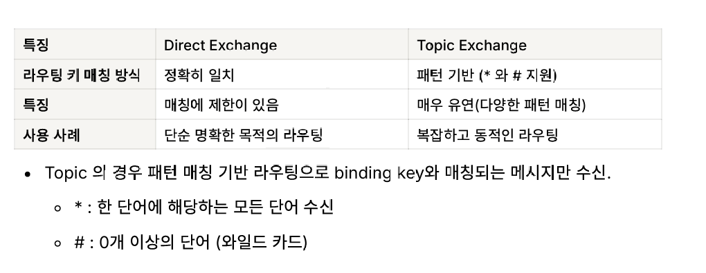
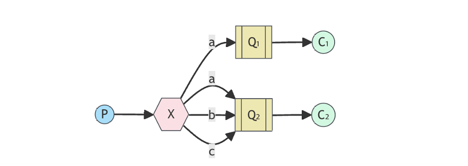
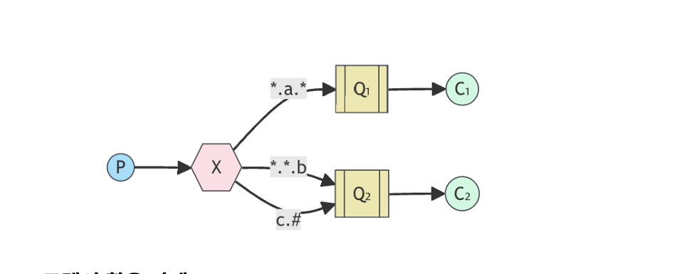

# Routing Model을 이용한 log 의 수집 
## Routing 모델
Routing 모델은 메시지를 Routing Key에 따라 특정 큐에 전달하는 기능으로 Fanout Exchange와 함께 가장 일반적인 모델이다.
Diretc 와 Topic Exchange 에서 사용이 가능하다.

## 주요 특징

1. 고성능
- 메시지를 필요한 곳에만 전달하기 때문에 네트워크 부하 감소 효과가 있고 브로드 캐스트보다 자원을 효율적으로 사용한다.
2. 라우팅 키 기반의 메시지 분배
- 각 큐는 하나 이상의 라우팅 키와 매칭
3. 바인딩 설정
- Direct Exchange는 정확한 매칭 기반으로 메시지를 라우팅한다.
- Topic Exchange는 패턴 기반 매칭으로 다양한 방식으로 유연하게 연겷.
- Exchange와 큐 사이의 관계를 바인딩 키를 통하여 메시지가 전달

그러나 라우팅 키와 바인딩 키가 일치 하지 않을 경우에 메시지가 전달이 안되고 다수의 큐와 라우팅 키를 관리할 경우 복잡성이 증가한다.

## 메시지의 흐름
1. Producer가 메시지와 함께 라우팅 키를 설정하여 메시지를 Exchange로 전송
2. Exchange는 바인딩 키를 확인하고 해당 키와 매칭되는 큐로 메시지를 전달한다
3. Consumer는 해당 큐에서 메시지를 소비한다.

- 와일드 카드로 모든 에러를 수신가능하다
