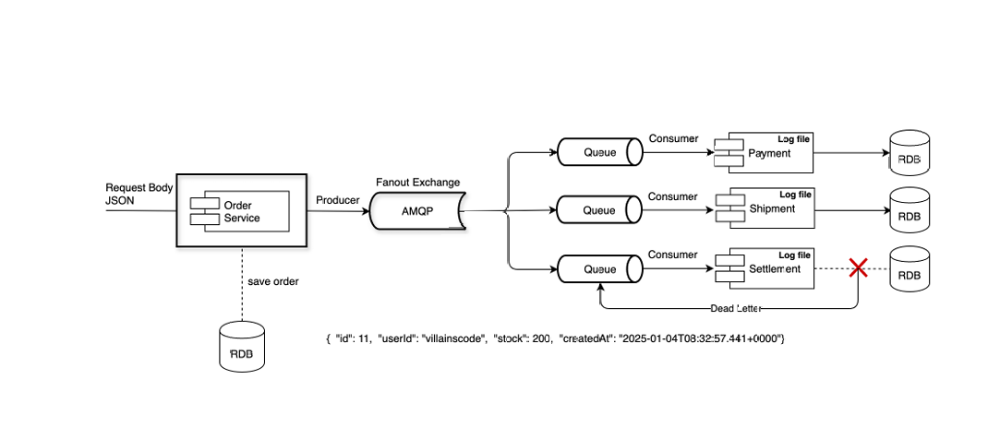

# Publisher Confirms를 이용한 트랜잭션 처리

### Publisher Confirms
메시지가 브로커의 Exchange에 도달했는지 확인하는 메커니즘
- 메시지가  RabbitMQ 브로커에 성공적으로 도달했는지 확인하기 위해 사용되는 경량화된 메커니즘으로 서로 다른 이기종간의 신뢰성 보정, 대사 기법인 TCC 와 비슷한 방법

이는 트랜잭션보다 성능이 뛰어나며, 메시지가 브로커에 안전하게 저장되었는지 확인하는 데 적합하고 가볍다는 특징이 있으므로. 시스템의 부담이 적고 빠르다.

특징 
1. 가볍고 빠름
- 개별 메시지 단위로 던송 후에 브로커로부터 확인(ack)을 받는다
- 트랜잭션 처럼 모든 메시지 작업을 롤백하지 않고. 실패한 메시지만 다시 처리한다.
2. 응답 처리 방식
- Ack: 브로커가 메시지를 성공적으로 처리했음을 알림.
- Nack: 브로커가 메시지 처리에 실패하였음을 알림.
3. 활용 사례
- 대규모 메시지 전송
- 메시지 손실 방지가 중요한 시스템 (결제, 알림)

단, 메시지 중복 가능성이 있고 지속성에 대한 비용이 존재할 수 있음
-  Nack 발생 시 재전송 과정에서 메시지 중복 가능성
-  중복 메시지 처리를 별도로 구현
- Persistent 설정 시 약간의 성능 저하
- txSelect 로 트랜잭션을 시작하는 RabbitMQ Transactions 방식 보다 (이 경우는 메시지 원자성 명시적 보장) 메시지를 비동기적 전송하며 RabbitMQ 서버에서 메시지가 정상적으로 저장되었는지 ack/nack로 확인하고 응답역시 비동기로 수신하기때문에 처리량이 높다.
- 실제 서버 환경마다 차이는 있으나 RabbitMQ Transactions 방식 보다 두배 이상의 전송 성능이 높다.

어떤 상황에서 쓰나요?
- 높은 처리량
- 개별 메시지 신뢰성 중요
- 성능이 중요한 대규모시스템

## TCC 기법 데이터 보정과 대사

메시지 큐를 가공하여 다른 시스템에 전달하였을 때, 이는 비동기 이기 때문에 트랜잭션으로 묶을 수 없다.
일반적인 케이스에서 물리적으로 코드도 다른 서버에 있고 트랜잭션 처리를 한다는 것이 큐의 비동기 사상과 맞지 않기 때문에 이 경우에는 양쪽 서버 쪽에서 데이터가 맞는지 대사 작업을 통하여 양쪽의 데이터가 일치하는지 여부를 확인하는 단계를 둔다.
시간 배치 작업이나 일별 배치등으로 양측의 데이터를 재확인하는 대사 작업을 한 뒤 틀어지는 데이터가 있다면 재보정을 해주는 후처리를 해주는 방식이다.
이 방식과 비슷하게 분산 서버간의 트랜잭션 처리를 TCC 로 만들어서 취소/확인과 확정의 단계를 두는 방식으로 처리하면 상당부분의 트랜잭션은 비교적 어렵지 않게 처리가 가능하다.
취소와 확인, 보정이라는 안정장치와 절차들을 통해 데이터를 확정짓는 패턴이다.

TCC를 이용한 구현 패턴은 서로 다른 두개의 도메인에 각각 요청한 결과에 대해서, 정상적으로 처리 된 경우의 응답이 오면 둘 다 확정하는 단계를 거치도록 하고 중간에 에러가 발생한 경우에 다른 하나에 대해서 취소 처리 프로세스를 호출하는게 패턴의 핵심 이다.

1) TCC 의 진행 프로세스
- 이 경우 직접적인 트랜잭션 레이어가 아니라 방버/보상 로직을 통해 확정 혹은 취소하는 방식이다.
- 전송되는 데이터의 원본을 저장하고 호출이 정상종료일 경우 확정, 비정상일 경우 취소 처리 한다.
- Consumer가 Confirm 혹은 exception 시에 cancel을 한 곳의 queue 로 발행한다
- 각 경계에서 전달되는 데이터들은 json으로 저장하고 이를 이용하여 로직을 처리하고 상태를 확정 처리한다.
- 타임아웃이나 예외가 발생하면 취소 상태를 요청 혹은 Expire 필드를 두어 처리한다.
- 

#### Message 레이어를 통한 Retry와 보정(후처리)
각 도메인으로 연결되는 경계 로직에서 Message Queue로 데이터를 Publish하고 각 도메인은 이 queue 를 바라보고 Message를 Consume한다.
이 단계에서 Message 솔루션들은 토픽에 대한 손실을 방지하기 위해서 자체적인 저장소를 유지해야 한다. 이 저장소를 통하여 미 처리된 Message에 대해서 Retry를 시도하여 최종적으로 요청된 토픽이 처리될 수 있도록 하며, 전송측과 구독측의 데이터 보정을 위하여 주기적으로 Sync하는 추가로직이 존재해야 한다.